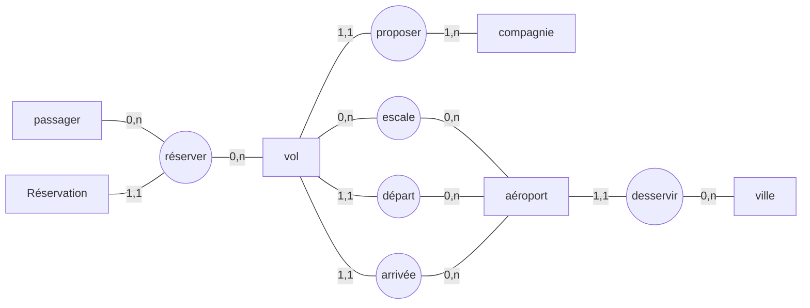
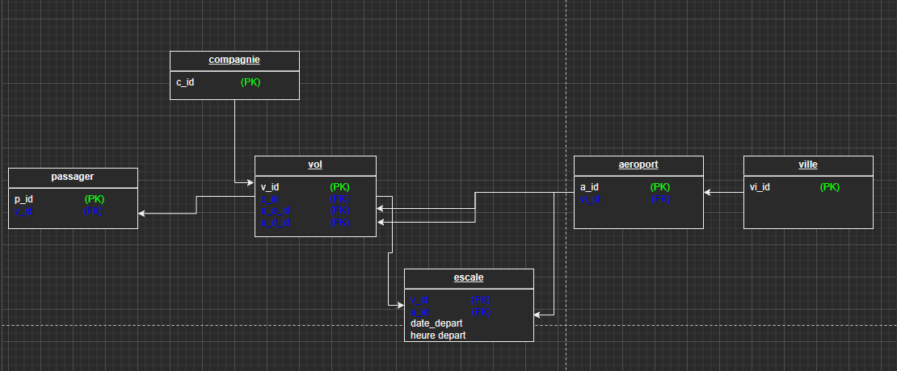

<!-- - [Bienvenu sur Travel !] -->

# Bienvenu sur Travel !

`Travel`, souhaite proposer la possibilité de **réserver en ligne des billets d'avion** à leurs clients.

Notre mission est de **concevoir** à l'aide du standard UML la **modélisation** de la plateforme.
# Méthode
> **MERISE** Méthode d'Étude et de Réalisation Informatique par les Sous-Ensembles ou pour les Systèmes d'Entreprises.
> Notre mission est de **concevoir** à l'aide du standard UML la **modélisation** de la plateforme.
#

Régle métier

 

- Le client :
	- peut réserver un vol ou plusieurs vols
	- peut réserver pour d'autres passagers
	- peut annuler une ou plusieurs réservations

- Une Réservation :
	- peut être annulée ou confirmée
	- Une réservation concerne un seul vol et un seul passager.

- Un vol :
	- peut être ouvert ou fermé à la réservation
	- peut être annulé par la compagnie
	- peut avoir un ou plusieurs escale
	- a un aéroport de départ 
	- a un aéroport d’arrivée.
	- a un jour et une heure de départ
	- a un jour et une heure d’arrivée.

- Un aéroport :
	- dessert une ou plusieurs villes.

- Une compagnie : 
	- proposent différents vols.
	- ouvre les réservations.
	- ferme les réservations.

- Une escale : 
	- a une heure d'arrivée.
	- a une heure de départ.

## Dictionnaire de données
| Donnée                        |  Nom attribut  |   Code | Type           |         Exemple         |      Remarque      |
| ----------------------------- | :------------: | -----: | -------------- | :---------------------: | :----------------: |
| client reserve                | client_reserve | CLIRES | Alphanumérique |                         |                    |
| client annule                 |      mail      | CLIANU | Alphanumérique |                         |                    |
| réservation   numéro          |      code      | RESCOD | Numérique      |                         |                    |
| réservation  état             |      état      | RESETA | Bool           |                         |  fermé vs ouvert   |
| réservation  du passager      |    passager    | RESPAS | Alphanumérique |         Franco          |                    |
| vol numéro                    |      code      | VOLCOD | Alphanumérique |         AIR35BG         |                    |
| vol état                      |      état      | VOLETA | Bool           |                         | annulé vs maintenu |
| vol escale                    |     escale     | VOLESC | Numérique      |                         |   nombre escale    |
| vol départ                    |     départ     | VOLDEP | Alphanumérique |          Paris          |                    |
| vol arrivée                   |    arrivée     | VOLARR | Alphanumérique |         Rennes          |                    |
| vol date départ               |  date_départ   | VODADE | Date           |                         |                    |
| vol date arrivée              |  date_arrivée  | VODAAR | Date           |                         |                    |
| aéroport                      |      nom       | AERNAM | Alphanumérique | Paris-charles-de-gaulle |                    |
| aéroport dessert              |    dessert     | AERDES | Alphanumérique |     HABIB BOURGIBA      |                    |
| compagnie aérienne            |      nom       | COMNAM | Alphanumérique |       AIR-France        |                    |
| compagnie          vols       |      vols      | COMVOL | Alphanumérique |     PARIS  MONASTIR     |                    |
| compagnie decide reservations |     decide     | COMDEC | Bool           |                         |                    |
| escale date arrivée           | escale_arrivée | ESDAAR | Date           |                         |                    |
| escale heure depart           | escale_depart  | ESDADE | Date           |                         |                    |
****

# MCD : modèle conceptuel de données

- Ceci est une illustration graphique plus compléte du [MCD](mcd.png)

# MLD
## Model logique de données (représentation textuel)

- **réservation**(<ins>res_id</ins>, res_numero, res_etat, **<ins>#p_id</ins>**, **<ins>#v_id</ins>**) 
- **passager**(<ins>p_id</ins>, p_nom, p_prenom, p_passport_n) 
- **vol**(<ins>v_id</ins>, v_numero, **<ins>#c_id</ins>**, **<ins>#a_depart</ins>**, **<ins>#a_arrivee</ins>**) 
- **compagnie**(<ins>c_id</ins>, c_nom) 
- **aeroport**(<ins>a_id</ins>, a_nom, **<ins>#vi_id</ins>**) 
- **escale**(e_date, e_heure, **<ins>#v_id</ins>**, **<ins>#a_id</ins>**) 
- **ville**(<ins>vi_id</ins>, vi_nom, vi_code_p, vi_departement) 

- Ceci est une illustration graphique du [MLD](mld.png)

# MPD : modèle physique de données

# Script SQL
~~~~sql
	CREATE TABLE compagnie(
	Id_compagnie COUNTER,
	nom VARCHAR(50) NOT NULL,
	PRIMARY KEY(Id_compagnie)
	);

	CREATE TABLE passager(
	Id_passager COUNTER,
	nom VARCHAR(50) NOT NULL,
	prenom VARCHAR(50) NOT NULL,
	passport_numero INT NOT NULL,
	PRIMARY KEY(Id_passager),
	UNIQUE(passport_numero)
	);

	CREATE TABLE ville(
	Id_ville COUNTER,
	nom VARCHAR(50) NOT NULL,
	code_postal INT NOT NULL,
	departement VARCHAR(50) NOT NULL,
	PRIMARY KEY(Id_ville)
	);

	CREATE TABLE aeroport(
	Id_aeroport COUNTER,
	nom VARCHAR(50) NOT NULL,
	Id_ville INT NOT NULL,
	PRIMARY KEY(Id_aeroport),
	FOREIGN KEY(Id_ville) REFERENCES ville(Id_ville)
	);

	CREATE TABLE vol(
	Id_vol COUNTER,
	numero INT NOT NULL,
	Id_compagnie INT NOT NULL,
	Id_aeroport_arrivee INT NOT NULL,
	Id_aeroport_depart INT NOT NULL,
	PRIMARY KEY(Id_vol),
	UNIQUE(numero),
	FOREIGN KEY(Id_compagnie) REFERENCES compagnie(Id_compagnie),
	FOREIGN KEY(Id_aeroport_arrivee) REFERENCES aeroport(Id_aeroport),
	FOREIGN KEY(Id_aeroport_depart) REFERENCES aeroport(Id_aeroport)
	);

	CREATE TABLE reservation(
	Id_reservation COUNTER,
	numero INT NOT NULL,
	etat LOGICAL NOT NULL,
	Id_vol INT NOT NULL,
	Id_passager INT NOT NULL,
	PRIMARY KEY(Id_reservation),
	UNIQUE(numero),
	FOREIGN KEY(Id_vol) REFERENCES vol(Id_vol),
	FOREIGN KEY(Id_passager) REFERENCES passager(Id_passager)
	);

	CREATE TABLE escale(
	Id_vol INT,
	Id_aeroport INT,
	date_depart DATE NOT NULL,
	heure_depart TIME NOT NULL,
	PRIMARY KEY(Id_vol, Id_aeroport),
	FOREIGN KEY(Id_vol) REFERENCES vol(Id_vol),
	FOREIGN KEY(Id_aeroport) REFERENCES aeroport(Id_aeroport)
	);
~~~~

